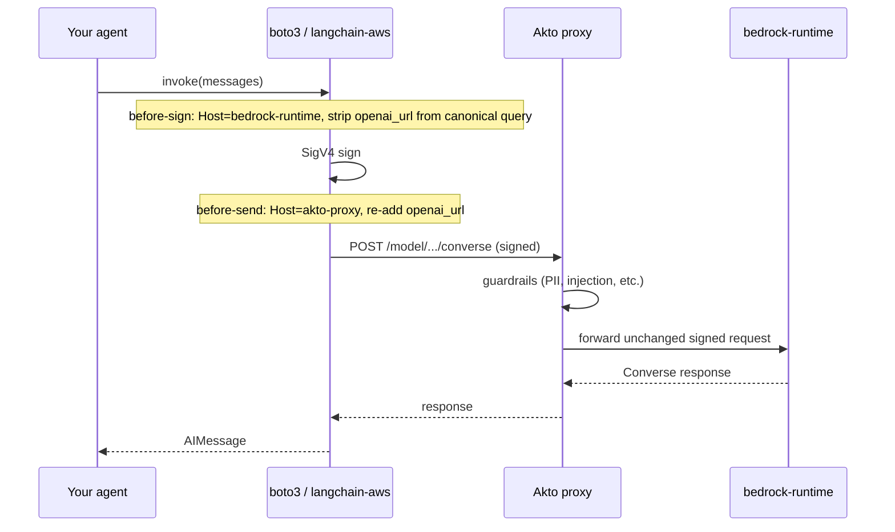

# Akto proxy integration for Bedrock agents

Guide for client teams running **LangChain / LangGraph agents** on **Amazon Bedrock** (boto3 + SigV4). The goal is a **minimal, reversible** change: route LLM traffic through Akto without rewriting your agent.

## What you change vs what stays the same

| Change | Keep as-is |
|--------|------------|
| Bedrock client wiring (`endpoint_url` + signing hooks) | Agent logic, tools, prompts, memory |
| One env var when proxy is enabled | IAM credentials (`AWS_PROFILE`, instance role, etc.) |
| Optional: copy `bedrock_config.py` | Model ID, region, business APIs |

**Rollback:** unset `BEDROCK_ENDPOINT_URL` — your app talks to Bedrock directly again.

---

## What Akto provides (before you start)

Your Akto team will give you:

1. **Proxy base URL** — e.g. `https://akto-proxy` (your tenant-specific host)
2. **Upstream Bedrock URL** — e.g. `https://bedrock-runtime.us-east-1.amazonaws.com`

Combined endpoint (this is what your app uses):

```text
https://akto-proxy?openai_url=https://bedrock-runtime.<region>.amazonaws.com
```

Replace `<region>` with your Bedrock region (`us-east-1`, `ap-south-1`, etc.).

---

## How it works (sign-then-relay)

Boto3 signs requests with **Host**, **path**, and **query string** baked into the signature. Akto sits in front of Bedrock, so the client must:

1. **Sign** as if the request goes to `bedrock-runtime.<region>.amazonaws.com`
2. **Send** the signed bytes to the Akto proxy (proxy `Host` on the wire)
3. **Re-attach** `openai_url` on the wire so Akto knows where to forward (this param is **not** part of the signature)



**You do not reimplement signing.** Copy the small hook module below (or equivalent in your language).

---

## Integration path A — LangChain / LangGraph (recommended)

This matches agents using `langchain-aws` (`ChatBedrockConverse` or `ChatBedrock`).

### Step 1 — Copy one file

Copy [`bedrock_config.py`](../bedrock_config.py) into your project (same directory as your agent entrypoint, or a shared `lib/` package).

No extra dependencies — it uses what you already have: `boto3`, `botocore`, `langchain-aws`, optional `python-dotenv`.

### Step 2 — Swap LLM construction (one line)

**Before:**

```python
from langchain_aws import ChatBedrockConverse

llm = ChatBedrockConverse(
    model_id="amazon.nova-micro-v1:0",
    region_name="us-east-1",
    credentials_profile_name="my-profile",
)
```

**After:**

```python
from bedrock_config import create_bedrock_llm

llm = create_bedrock_llm()  # reads model/region/profile from env
# or: llm = create_bedrock_llm("amazon.nova-micro-v1:0")
```

Use `create_bedrock_llm()` anywhere you build the Bedrock LLM — including inside `create_react_agent(...)`.

### Step 3 — Set environment variables

**Direct Bedrock (today, no proxy):**

```env
AWS_PROFILE=my-bedrock-profile
AWS_REGION=us-east-1
BEDROCK_MODEL_ID=amazon.nova-micro-v1:0
# BEDROCK_ENDPOINT_URL unset
```

**Via Akto proxy (add one line):**

```env
BEDROCK_ENDPOINT_URL=https://akto-proxy?openai_url=https://bedrock-runtime.us-east-1.amazonaws.com
```

That is the only difference when enabling the proxy.

### Step 4 — Verify

```bash
# Direct
python debug_bedrock.py

# Proxy
export BEDROCK_ENDPOINT_URL="https://akto-proxy?openai_url=https://bedrock-runtime.us-east-1.amazonaws.com"
python debug_bedrock.py
```

Expected: `SUCCESS — model reply: 'ok'` in both modes. In proxy mode, wire logs should show the Akto host in the URL and `Authorization: AWS4-HMAC-SHA256 ...`.

---

## Integration path B — Raw boto3 (no LangChain)

If you call `bedrock-runtime` directly:

```python
import os
import boto3
from botocore.config import Config

from bedrock_config import (
    install_proxy_sigv4_signing,
    resolve_endpoint_url,
    resolve_proxy_signing_config,
)

endpoint_url = resolve_endpoint_url()  # from BEDROCK_ENDPOINT_URL

client = boto3.client(
    "bedrock-runtime",
    region_name=os.environ["AWS_REGION"],
    endpoint_url=endpoint_url,
    config=Config(connect_timeout=90, read_timeout=90, retries={"max_attempts": 0}),
)

proxy_config = resolve_proxy_signing_config()
if proxy_config:
    install_proxy_sigv4_signing(client, proxy_config)

response = client.converse(
    modelId=os.environ["BEDROCK_MODEL_ID"],
    messages=[{"role": "user", "content": [{"text": "Hello"}]}],
)
```

Same env vars as path A.

---

## Environment variables

| Variable | Required | Description |
|----------|----------|-------------|
| `BEDROCK_ENDPOINT_URL` | For proxy only | Full Akto URL including `openai_url` query param |
| `AWS_REGION` | Yes | Bedrock region (must match `openai_url` host) |
| `AWS_PROFILE` | If using profiles | IAM profile with `bedrock:InvokeModel` / `bedrock:Converse` |
| `BEDROCK_MODEL_ID` | Recommended | Model or inference profile ID |
| `BEDROCK_SIGNING_HOST` | Rarely | Override signing host if proxy URL has no `openai_url` |
| `BEDROCK_MAX_TOKENS` | Optional | Default `256` |
| `LLM_TIMEOUT_SECONDS` | Optional | Default `90` |
| `BEDROCK_API` | Optional | `converse` (default) or `invoke` |

### Do not mix SigV4 and Bearer

If `AWS_PROFILE` or `AWS_ACCESS_KEY_ID` is set, **unset** `AWS_BEARER_TOKEN_BEDROCK`. Boto3 prefers Bearer when both are present, which breaks IAM-based proxy signing.

`bedrock_config.py` clears Bearer automatically when a profile/key is detected (unless `BEDROCK_USE_BEARER=true`).

---

## Deployment patterns

### Local / staging

```bash
export BEDROCK_ENDPOINT_URL="https://akto-proxy?openai_url=https://bedrock-runtime.us-east-1.amazonaws.com"
export AWS_PROFILE=my-bedrock-profile
export AWS_REGION=us-east-1
python -m your_agent
```

### Docker / Kubernetes

Add `BEDROCK_ENDPOINT_URL` to the container env or ConfigMap. No image rebuild required if `bedrock_config.py` is already in the codebase — toggle proxy per environment.

```yaml
# example K8s snippet
env:
  - name: BEDROCK_ENDPOINT_URL
    value: "https://akto-proxy?openai_url=https://bedrock-runtime.us-east-1.amazonaws.com"
  - name: AWS_REGION
    value: "us-east-1"
```

Use IRSA / instance role for credentials; `AWS_PROFILE` is not needed in production if the pod/task role has Bedrock access.

### Feature flag (optional)

```python
import os
from bedrock_config import create_bedrock_llm

def build_llm():
    return create_bedrock_llm()  # respects BEDROCK_ENDPOINT_URL when set
```

Enable proxy in staging by setting the env var; leave it unset in dev if you want direct Bedrock.

---

## Guardrails and blocked requests

When Akto blocks a request (PII, prompt injection, custom policy), SigV4 clients receive a **200 OK** with a normal Bedrock Converse-shaped body — the block reason appears as assistant text. Your agent should surface that text like any other model reply.

No special error handling is required if you use `create_bedrock_llm()`.

---

## Checklist before go-live

- [ ] `bedrock_config.py` copied; `create_bedrock_llm()` used for all Bedrock LLM instances
- [ ] `BEDROCK_ENDPOINT_URL` set to Akto-provided URL (with `openai_url`)
- [ ] `AWS_REGION` matches the region in `openai_url`
- [ ] `AWS_BEARER_TOKEN_BEDROCK` unset when using IAM/SigV4
- [ ] `debug_bedrock.py` (or equivalent) succeeds in direct and proxy modes
- [ ] Agent end-to-end test passes (tool calls, multi-turn if applicable)
- [ ] Akto dashboard shows traffic for your agent server hostname

---

## Troubleshooting

| Symptom | Likely cause | Fix |
|---------|--------------|-----|
| `InvalidSignatureException` | Signature computed for wrong Host or query | Ensure `bedrock_config` hooks are installed; `openai_url` must be stripped before sign |
| `403` with empty message | Old gateway returning partial JSON on block | Upgrade Akto gateway; blocked SigV4 should be 200 + Converse envelope |
| `AccessDenied` from Bedrock | IAM policy | Confirm role has `bedrock:Converse` / `bedrock:InvokeModel` for your model |
| Requests hit AWS directly | `BEDROCK_ENDPOINT_URL` not set or not passed to client | Set env var; confirm `create_bedrock_llm()` / `endpoint_url=` is used |
| Bearer auth instead of SigV4 | `AWS_BEARER_TOKEN_BEDROCK` set alongside profile | Unset Bearer token |
| Wrong region | `AWS_REGION` ≠ `openai_url` region | Align region and upstream URL |

---

## Quick reference

```env
# Enable Akto proxy (only change for most teams)
BEDROCK_ENDPOINT_URL=https://akto-proxy?openai_url=https://bedrock-runtime.<region>.amazonaws.com
```

```python
# Only code change for LangChain agents
from bedrock_config import create_bedrock_llm
llm = create_bedrock_llm()
```

```bash
# Smoke test
python debug_bedrock.py
```

For internal AWS account setup (IAM roles, Bedrock access), see [AWS-BOOTSTRAP.md](AWS-BOOTSTRAP.md).
